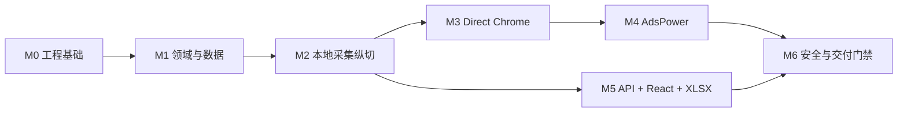

# X 关注关系监控——阶段 A 开发计划

> 状态：已完成 0.14（A-01 至 A-14 已完成）
> 日期：2026-09-15
> 输入：需求基线 1.3 + [阶段 A 技术设计](./phase-a-technical-design.md) 0.1  
> 目标：可按任务顺序直接实施、测试和验收

## 1. 执行原则

- 以可运行的纵向闭环为交付单位，不先写大量未被用例驱动的通用框架。
- 每个任务在合并前必须通过本任务列出的自动化测试，并不得破坏已通过的契约测试。
- 使用本地模拟 X 页和固定载荷实现可重复验证；真实 Chrome 只访问本地夹具，AdsPower 按用户决定不再测试。
- 任何绕过完整性校验、使用 X 显示名作关联键、记录 CDP/Cookie/token 或在 HTTP 请求内运行浏览器的实现不得合并。

## 2. 里程碑

| 里程碑 | 可演示结果 |
| --- | --- |
| M0 | API、worker、web 可启动，迁移和基础检查可运行 |
| M1 | 固定快照可事务化提交并生成正确关系事件 |
| M2 | 模拟 X 页可通过 worker 完成采集到快照的端到端流程 |
| M3 | Direct Chrome 可绑定、扫描和重新验证 |
| M4 | 同一采集器不改动即可通过 AdsPower 执行 |
| M5 | 用户可从 React 完成绑定、扫描、查看、确认和 XLSX 下载 |
| M6 | 高风险测试、性能基线、崩溃恢复和部署/回滚演练通过 |

## 3. 任务清单

### A-01 初始化单仓库工程（已完成）

**依赖**：无  
**产物**：Python/React 骨架、开发命令、静态检查和测试入口

- 创建 `pyproject.toml`，约定 Python 3.12+、FastAPI、Pydantic、SQLAlchemy 2、aiosqlite、Alembic、Playwright、openpyxl、pytest 和 pytest-asyncio。
- 创建 `apps/api`、`apps/worker`、`src/x_follow_list` 与 `tests` 包结构。
- 创建 Vite + React + TypeScript 的 `web` 目录，配置 ESLint、TypeScript 检查和单元测试入口。
- 提供 `.env.example`，仅列出变量名和安全说明，不包含真实密钥。
- 提供统一命令：格式、lint、类型检查、后端测试、前端测试、迁移检查。

**验证**：空应用的 API liveness、worker 启动/安全退出、React shell 和前后端检查全部通过。  
**映射**：AC-15（基础）

### A-02 配置、日志与数据库基础（已完成）

**依赖**：A-01  
**产物**：类型化配置、脱敏日志、async engine/session、Alembic 基线

- 实现按环境加载的 Settings，强制生产密钥不使用默认值。
- SQLite 连接启用 foreign keys、WAL 和 busy timeout。
- 实现 request/scan correlation context 和统一 secret redaction filter。
- 创建第一版 Alembic schema：users、provider configs、accounts、runs、leases、idempotency keys、audit logs。
- 创建 `/health/live` 和只检查基础数据库状态的 `/health/ready`。

**测试**：PRAGMA 每连接生效、迁移 up/down、密钥脱敏、无效配置 fail fast。  
**映射**：AC-13、AC-15

### A-03 本地 OWNER 身份验证与授权边界（已完成）

**依赖**：A-02  
**产物**：一次性 bootstrap、安全 session、资源所属查询

- 实现只允许首次运行的 OWNER bootstrap。
- 实现密码哈希、session cookie、CSRF/origin 检查、登录和退出。
- 资源 repository 以 owner/membership 为查询起点，并统一 404 语义。
- 对所有状态变更写入审计事件。

**测试**：第二次 bootstrap 被拒绝、CSRF、session 过期、两用户资源枚举和附件跨用户访问。  
**映射**：AC-13

### A-04 关系域模型与状态机（已完成）

**依赖**：A-01  
**产物**：无基础设施依赖的关系比对库

- 定义 `MUTUAL`、`NOT_FOLLOWING_BACK`、`FOLLOWS_ME_ONLY`、`ABSENT`。
- 实现首次基线、连续未回关 streak 和全迁移矩阵。
- 生成普通变化事件和 `UNFOLLOWED_ME_AFTER_MUTUAL`，生成稳定 dedupe key。
- 保留规则冲突评估输入类型，但阶段 A 不实现黑名单 repository/UI。

**测试**：两个快照中所有前后状态组合、空集、用户名变更、失败扫描不调用状态机、重放幂等。  
**映射**：AC-04、AC-06、AC-19（P0 部分）

### A-05 快照持久化与原子提交（已完成）

**依赖**：A-02、A-04  
**产物**：staging、snapshot、membership、state、event repository 和提交用例

- 添加相关表和索引迁移。
- 实现 staging 批量 upsert 和扫描级计数器。
- 实现“验证通过 → 快照 → diff/state/event → run/account 统计”单事务。
- 实现失败扫描保留上一成功快照、不增加 streak、不生成 event。
- 实现过期 staging 清理用例，阶段 A 先提供手工/启动时执行入口。

**测试**：每个事务写入点故障注入、重复 ID、重放同一 run、上一 snapshot 竞态和 5 万/5 万夹具。  
**映射**：AC-03、AC-05、AC-06、AC-14

### A-06 持久化任务领取、租约与恢复（已完成）

**依赖**：A-02  
**产物**：worker loop、conditional claim、resource leases、fencing 和启动恢复

- API 幂等创建 `QUEUED` scan run。
- worker 使用条件更新领取，状态转为 `RUNNING`。
- 按账号锁、profile 锁顺序获取租约，定期心跳。
- 写入终态和关键业务数据时验证 fencing token。
- 启动时将过期租约对应的遗留任务标记失败，不自动从中间分页续跑。

**测试**：两 worker 同时 claim、相同 profile 冲突、心跳丢失、租约过期、迟到 worker 写入和进程强制终止。  
**映射**：AC-05、AC-06、AC-14、AC-17

### A-07 Browser Provider 注册表与契约套件（已完成）

**依赖**：A-02、A-06  
**产物**：Provider Protocol、registry、capabilities、共享契约测试

- 实现 `validate_config`、`list_profiles`、`acquire`、`health_check`、`close` 契约。
- 实现会话所有权和幂等释放。
- 实现 provider config 版本、secret reference 与端点安全校验。
- 提供 `FakeBrowserProvider`，用于不启动真实浏览器的 worker 集成测试。

**测试**：所有 Provider 共用的 contract suite，包括敏感值不进入异常/日志。  
**映射**：AC-12、AC-17

### A-08 模拟 X 页、导航器、响应收集器和解析器（已完成）

**依赖**：A-05、A-07  
**产物**：可重复的本地页、版本化夹具、采集器和完整性守卫

- 创建本地 SPA 夹具，可配置分页、终点、重复 cursor、空载荷、未知 schema、挑战页和中途断线。
- 实现 DOM Navigator 与 Response Collector，保证监听先于导航注册。
- 实现 parser 输出和版本识别，仅使用 X user ID 去重。
- 实现需求基线 9.3 的全部阈值和骤降复核状态。
- 页面结构/解析变化时返回可操作错误，不使用 DOM 卡片伪造完整集。

**测试**：夹具矩阵的 parser unit + collector integration + browser E2E，每个失败场景验证无正式 snapshot/event。  
**映射**：AC-02、AC-03、AC-05、AC-12

### A-09 Direct Chrome Provider 与交互式绑定（已完成）

**依赖**：A-03、A-07、A-08  
**产物**：Direct Chrome 会话生命周期、绑定任务和重新验证

- 创建受保护独立 `user-data-dir`，使用已安装 Google Chrome 可见启动。
- 绑定 worker 等待用户手工登录，只读获取当前 X user ID，由用户确认。
- 添加 `browser_bind_sessions` 迁移、独立 claim/超时生命周期和 `/x-account-bind-sessions` API。
- 实现 15 分钟超时、用户取消、`REAUTH_REQUIRED` 和安全释放。
- 绑定后执行本地模拟页扫描的首个真实浏览器纵向闭环。

**测试**：临时 profile 启停、超时、重启保留会话、解绑删除、不读取日常 Chrome profile。  
**映射**：AC-01、AC-12、AC-17

### A-10 AdsPower Provider（已完成）

**依赖**：A-07、A-08、A-09  
**产物**：AdsPower config/profile/start/CDP/stop 完整适配器

- 实现受控 Provider API client，含超时、有限重试、响应限制、错误映射和脱敏。
- 实现列出/选择已有 profile，不创建、删除或修改指纹/代理。
- 实现启动所有权、CDP 端点验证、`connect_over_cdp` 和所有权感知的 stop/detach。
- 记录 adapter/provider/browser 版本，建立支持版本矩阵。

**测试**：历史检查点已用伪 Provider API + 可控 CDP 浏览器覆盖错误 URL、恶意重定向、无效 token、已运行 profile、由本任务启动的 profile、断线和重复释放。自 A-14 起按用户决定不再执行 AdsPower 自动化或实机测试；A-10 代码与历史证据保留。
**映射**：AC-01、AC-12、AC-17

### A-11 扫描应用服务与 API（已完成）

**依赖**：A-03、A-05、A-06、A-08  
**产物**：账号、绑定、扫描、关系、事件和进度 API

- 实现技术设计 10.2 的端点。
- 创建扫描使用 `Idempotency-Key`，并阻止同账号重复排队/运行。
- 任务详情返回分层状态、进度阶段、计数和可操作错误，不返回内部异常。
- 关系和事件列表支持稳定 cursor、账号边界、搜索、状态筛选和确认。

**测试**：OpenAPI schema 回归、所有端点授权、分页稳定性、幂等、冲突 409、错误脱敏和失败任务保留上一快照。  
**映射**：AC-06、AC-08、AC-13

### A-12 React 后台纵向闭环（已完成）

**依赖**：A-11  
**产物**：总览、账号、扫描、关系、待处理页

- 生成/封装类型安全 API client，统一错误和 session 处理。
- 实现 Provider config/profile 选择、绑定进度、账号确认和重新验证。
- 实现手工扫描、退避轮询、任务详情和可操作错误。
- 实现关系分组/筛选与 `UNFOLLOWED_ME_AFTER_MUTUAL` 首屏指标和待处理确认。
- 任务失败时明确显示上一成功数据时间，不显示伪空集。

**测试**：Mock Service Worker 的成功/失败流程、轮询停止、空态/错误态、授权过期、键盘可达和基础无障碍。  
**映射**：AC-08、AC-13、AC-19（P0 部分）

### A-13 XLSX 生成与安全下载（已完成）

**依赖**：A-05、A-11  
**产物**：流式 XLSX、artifact 元数据、幂等重建和授权下载

- 生成阶段 A 的 6 个工作表，所有行定位到指定 scan/snapshot。
- 实现公式注入防护、空值处理、UTC/时区呈现和大数据 write-only 模式。
- 文件原子发布，记录 SHA-256、大小、到期时间和删除状态。
- 下载检查 owner/membership，设置附件头、MIME 和 `nosniff`。

**测试**：每个 sheet/字段、恶意公式字符串、5 万行内存、重建幂等、中途写入失败无半文件、跨用户下载 404。  
**映射**：AC-09、AC-13、AC-14

### A-14 端到端、安全、性能与发布门禁（已完成）

**依赖**：A-09至 A-13  
**产物**：可重复验收记录、部署文档和阶段 A 发布候选版

- 用 Direct Chrome + 本地 X 模拟页执行“绑定 → 两次扫描 → 事件 → UI → XLSX” E2E。
- 记录 AdsPower 退出当前发布验证范围的用户决定；不执行自动化或实机测试，也不声明真实环境通过。
- 执行 SSRF/CDP 端点、凭据日志、跨用户枚举、XLSX 公式注入和文件路径穿越测试。
- 执行任务步骤故障注入、worker kill/restart、租约丢失和 staging 清理。
- 执行 5 万/5 万夹具的 API p95、比对耗时和内存基线。
- 编写开发/生产配置、备份恢复、迁移、回滚、健康检查和已知限制文档。

**通过条件**：除已明确退出范围的 AdsPower 真实能力外，技术设计第 19 节阶段 A 退出条件满足，无未说明高风险安全/隐私问题。
**映射**：AC-01至 AC-06、AC-08、AC-09、AC-12至 AC-15、AC-17、AC-19（P0 部分）

## 4. 依赖顺序

| 任务 | 直接依赖 | 可否与其他任务并行 |
| --- | --- | --- |
| A-01 | 无 | 否，先完成 |
| A-02 | A-01 | 可与 A-04 并行 |
| A-03 | A-02 | 可与 A-05/A-06 的无 API 部分并行 |
| A-04 | A-01 | 可与 A-02 并行 |
| A-05 | A-02, A-04 | 可与 A-06 并行 |
| A-06 | A-02 | 可与 A-05 并行 |
| A-07 | A-02, A-06 | 否 |
| A-08 | A-05, A-07 | 否 |
| A-09 | A-03, A-07, A-08 | 可与 A-11 的查询 API 部分并行 |
| A-10 | A-07, A-08, A-09 | 可与 A-12/A-13 并行 |
| A-11 | A-03, A-05, A-06, A-08 | 否 |
| A-12 | A-11 | 可与 A-10/A-13 并行 |
| A-13 | A-05, A-11 | 可与 A-10/A-12 并行 |
| A-14 | A-09–A-13 | 否，发布收口 |

## 5. 建议提交切片

每个切片必须可独立测试，不把整个里程碑压成一个巨型变更。

1. `chore: bootstrap backend and frontend workspace`
2. `feat: add sqlite configuration and initial migrations`
3. `feat: add owner bootstrap and session authorization`
4. `feat: implement relationship state machine`
5. `feat: commit complete relationship snapshots atomically`
6. `feat: add durable scan claims and resource leases`
7. `feat: define browser provider contract and test suite`
8. `test: add local x relationship fixture application`
9. `feat: collect versioned relationship response payloads`
10. `feat: bind and scan with direct chrome`
11. `feat: add adspower browser provider`
12. `feat: expose account scan and relationship APIs`
13. `feat: add relationship monitoring admin ui`
14. `feat: generate protected xlsx scan artifacts`
15. `test: add phase a end-to-end and release gates`

## 6. 阶段 B 衔接点

阶段 A 完成后，按以下顺序扩展，不回改采集核心：

1. `account_rules` + 白名单/业务黑名单 UI。
2. 在 snapshot commit 后运行 `G ∩ B` 评估，生成 `FOLLOWING_BLOCKLISTED_ACCOUNT`。
3. `notification_intents` + `notification_channel_configs` + `notification_deliveries`。
4. Telegram/SMTP Channel Adapter 和共享契约测试。
5. APScheduler 周期触发、30 天清理、审计和通知重试。

## 7. 立即执行的下一项

A-01 至 A-14 已完成，并保留对应 TDD 证据：[A-01](./docs/tdd/a-01-bootstrap.tdd.md)、[A-02](./docs/tdd/a-02-config-logging-database.tdd.md)、[A-03](./docs/tdd/a-03-owner-auth.tdd.md)、[A-04](./docs/tdd/a-04-relationship-domain.tdd.md)、[A-05](./docs/tdd/a-05-snapshot-persistence.tdd.md)、[A-06](./docs/tdd/a-06-scan-coordination.tdd.md)、[A-07](./docs/tdd/a-07-browser-provider-contract.tdd.md)、[A-08](./docs/tdd/a-08-local-x-collector.tdd.md)、[A-09](./docs/tdd/a-09-direct-chrome-binding.tdd.md)、[A-10](./docs/tdd/a-10-adspower-provider.tdd.md)、[A-11](./docs/tdd/a-11-scan-relationship-api.tdd.md)、[A-12](./docs/tdd/a-12-react-admin.tdd.md)、[A-13](./docs/tdd/a-13-xlsx-artifacts.tdd.md)、[A-14](./docs/tdd/a-14-release-gates.tdd.md)。阶段 A 已收口；下一开发项按第 6 节进入阶段 B。AdsPower 按用户决定不再测试，不是延期项，也不声明真实环境通过。
