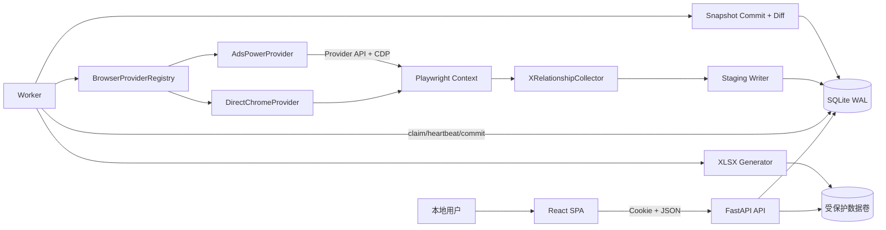
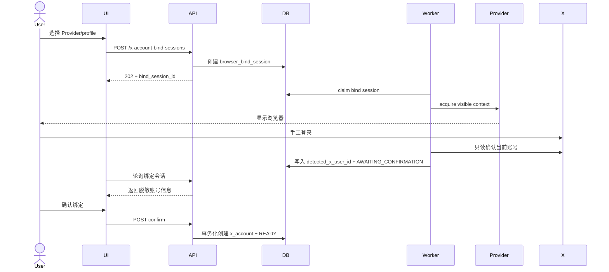
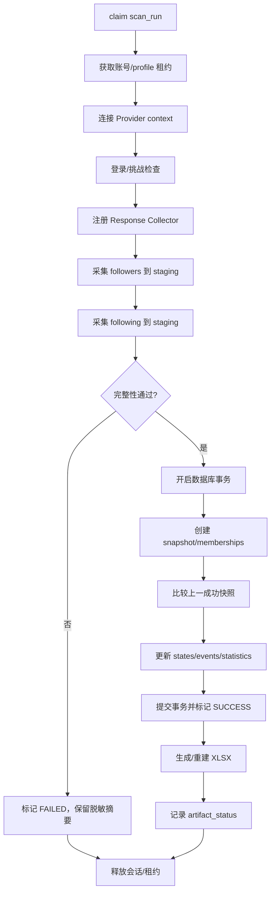
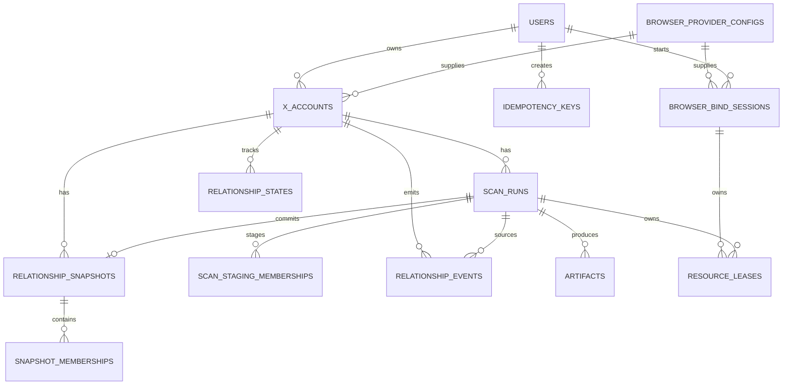

# X 关注关系监控——阶段 A 技术设计

> 状态：待评审 0.1  
> 日期：2026-09-13  
> 需求基线：[x-relationship-browser-monitor-requirements.md](./x-relationship-browser-monitor-requirements.md) 1.3  
> 交付范围：阶段 A 自托管验证版

## 1. 设计目标

阶段 A 交付一个可本地部署、可从浏览器绑定到结果导出的端到端闭环：

1. 通过 Direct Chrome 或 AdsPower 绑定一个 X 账号。
2. 手工发起 followers/following 完整扫描。
3. 只有完整扫描才事务化提交快照。
4. 与上一个成功快照比较，计算关系状态和变化事件。
5. 在 React 后台查看账号、任务、关系和重点待处理项。
6. 生成不含敏感信息的 XLSX 结果。

阶段 A 不交付周期调度、Telegram/邮件投递、完整规则管理和 SaaS 远程本地代理；但数据模型和扩展契约不得阻断阶段 B。

## 2. 关键设计决策

| ID | 决策 | 理由 |
| --- | --- | --- |
| TD-01 | 单仓库、两进程：FastAPI API + Python worker | API 不承载长时间浏览器任务，也无需在 MVP 引入消息中间件 |
| TD-02 | SQLite 同时作为业务库和持久化任务队列 | 单机自托管足够；任务领取使用条件更新和租约 |
| TD-03 | 统一异步 Python 边界 | FastAPI、SQLAlchemy async 和 Playwright async 的执行模型一致 |
| TD-04 | Browser Provider 返回统一的 Playwright 会话句柄 | X 采集器不感知 Direct Chrome、AdsPower 或未来 Multilogin |
| TD-05 | 采集数据先逐批写入 staging，再单事务提升 | 浏览器中断、解析变化或数据骤降不得污染基线 |
| TD-06 | 域状态机为纯函数，持久化由应用服务完成 | 便于用固定夹具穷举迁移并避免 ORM 副作用 |
| TD-07 | 后台使用同源 HTTP-only session cookie | 自托管 MVP 简化身份验证，同时保留服务端授权检查 |
| TD-08 | XLSX 从已提交快照生成 | 附件与后台数据共用同一个业务事实 |

## 3. 系统架构



### 3.1 进程职责

`api` 进程：

- 身份验证、资源授权和请求幂等。
- Browser Provider 配置、X 账号、扫描任务和查询 API。
- 返回短期附件下载授权，不直接暴露物理路径。
- 只创建 `QUEUED` 任务，不在 HTTP 请求内启动浏览器。

`worker` 进程：

- 领取任务、维护租约和心跳。
- 获取账号/profile 锁，启动或连接浏览器。
- 执行采集、完整性校验、快照提交、状态比对和 XLSX 生成。
- 保证只释放自己获取的资源，并将可操作失败写入 `error_code`。

## 4. 仓库与包结构

```text
.
├─ apps/
│  ├─ api/main.py
│  └─ worker/main.py
├─ src/x_follow_list/
│  ├─ api/                 # routers, schemas, dependencies
│  ├─ application/         # use cases and transaction boundaries
│  ├─ domain/              # relationship state machine and policies
│  ├─ browser/
│  │  ├─ contracts.py
│  │  ├─ registry.py
│  │  ├─ direct_chrome.py
│  │  └─ adspower.py
│  ├─ collector/           # navigator, response collector, parsers
│  ├─ persistence/         # SQLAlchemy models, repositories, leases
│  ├─ artifacts/           # XLSX and protected storage
│  ├─ security/            # secrets, auth, redaction
│  └─ observability/       # structured logging and metrics
├─ migrations/                  # Alembic
├─ web/                         # React + TypeScript + Vite
├─ tests/
│  ├─ unit/
│  ├─ integration/
│  ├─ contract/
│  ├─ e2e/
│  └─ fixtures/
├─ deploy/
│  └─ docker-compose.yml
└─ pyproject.toml
```

域层不引用 FastAPI、Playwright 或 SQLAlchemy。应用层通过 Protocol/仓储接口组织用例，基础设施层提供实现。

## 5. Browser Provider 设计

### 5.1 统一契约

```python
class BrowserProvider(Protocol):
    code: str
    version: str

    async def validate_config(self, config: ProviderConfig) -> CapabilityReport: ...
    async def list_profiles(self, config: ProviderConfig) -> list[ProfileSummary]: ...
    async def acquire(self, request: BrowserSessionRequest) -> BrowserSession: ...

class BrowserSession(Protocol):
    context: BrowserContext
    provider_code: str
    profile_key: str
    started_by_current_task: bool

    async def health_check(self) -> None: ...
    async def close(self) -> None: ...
```

`BrowserSession.close()` 是幂等的。Provider 必须隐藏 CDP URL、token 和原始 provider 响应；日志只记录 provider code、adapter version 和 profile key 的不可逆摘要。

### 5.2 Direct Chrome

- 使用 `playwright.chromium.launch_persistent_context(channel="chrome", user_data_dir=...)`。
- 每个绑定账号使用系统管理的独立 profile，不读取用户日常 Chrome profile。
- 登录绑定时 `headless=false`；扫描仍默认可见，不使用 stealth 参数。
- 进程启动失败返回 `BROWSER_START_FAILED`，不自动切换到其他 profile。

### 5.3 AdsPower

- Provider config 包含受控 API base URL、超时和 secret reference；任务载荷不接受任意 URL。
- 绑定时列出可用 profile，用户选择 profile ID；MVP 不在 AdsPower 中创建、删除或修改指纹/代理。
- 获取 profile 锁后检查运行状态。若未运行，由当前任务启动并记录所有权。
- 从 Provider API 的经验证结果中获得 CDP 端点，然后使用 `connect_over_cdp`。只接受与已配置 Provider 主机/允许网段相符的端点。
- 释放时，当前任务启动的 profile 可停止；原本已运行的 profile 只断开 Playwright。

### 5.4 锁和租约

按固定顺序获取两个资源：

1. `x-account:{x_account_id}`
2. `browser-profile:{provider_config_id}:{profile_ref_hash}`

`resource_leases` 包含 `resource_key`、`owner_task_type`、`owner_task_id`、`fencing_token`、`heartbeat_at`、`expires_at`。领取和续租使用短事务；worker 丢失租约后立即停止导航和写入。每个关键写入都验证 fencing token，防止迟到 worker 覆盖新任务。

## 6. 绑定与扫描流程

### 6.1 绑定



绑定任务超时默认 15 分钟。超时只关闭当前任务启动的浏览器，不清除用户已完成但尚未确认的 provider profile。

### 6.2 扫描



followers 与 following 可串行执行，降低同一页面会话的复杂度。每批 staging 写入使用唯一键去重，内存中只保留当前批和完整性计数器。

## 7. 采集器与解析器

### 7.1 组件

- `DomNavigator`：账号页导航、followers/following 入口、滚动、终点和挑战页识别。
- `ResponseCollector`：在导航前注册响应监听，将候选响应传递给解析器。
- `PayloadClassifier`：使用结构特征而非单一 URL/hash 判断载荷类型。
- `VersionedParser`：输出 `ParsedPage(items, next_cursor, terminal, schema_version, rejected_count)`。
- `CompletenessGuard`：实施需求基线 9.3 的游标、空载荷、精确总数、骤降和拒绝条目阈值。

### 7.2 解析器版本策略

- 解析器以内部 `parser_version` 发布，每个版本必须有脱敏 JSON 夹具。
- 任何未知根结构、用户 ID 缺失或拒绝比超限均 fail closed。
- DOM 降级只用于导航和状态确认，不在结构未知时把可见卡片拼成“完整列表”。
- 诊断默认只保存结构摘要、字段路径和计数；原始响应需用户显式开启且脱敏后才能保存。

## 8. 数据设计

### 8.1 阶段 A 实体



阶段 A 必须创建：`users`、`browser_provider_configs`、`browser_bind_sessions`、`x_accounts`、`scan_runs`、`scan_staging_memberships`、`relationship_snapshots`、`snapshot_memberships`、`relationship_states`、`relationship_events`、`artifacts`、`resource_leases`、`idempotency_keys`、`audit_logs`。

`browser_bind_sessions` 是独立的交互式后台任务，包含 `id`、`owner_user_id`、`provider_config_id`、`profile_ref`、`status`、`detected_x_user_id`、`expires_at`、`error_code`和时间字段。它不写入 `scan_runs`，只有用户确认后才创建/更新 `x_accounts`。

`account_rules`、`notification_intents`、`notification_deliveries` 和渠道配置在阶段 B 实现。阶段 A 可在域事件枚举中预留 `FOLLOWING_BLOCKLISTED_ACCOUNT`，但不创建空壳表或虚假功能。

### 8.2 事务边界

成功扫描的单一提交事务必须包含：

1. 创建正式 snapshot 和 memberships。
2. 读取并锁定当前账号的上一成功 snapshot。
3. 计算并 upsert `relationship_states`。
4. 幂等插入 `relationship_events`。
5. 更新 `scan_runs` 统计、`x_accounts.last_successful_scan_at` 和快照指针。
6. 提交后才清理对应 staging。

XLSX 在业务事务提交且 `scan_runs.status=SUCCESS` 后生成。生成失败不回滚快照、不改写扫描成功状态；任务另行记录 `artifact_status=FAILED` 并允许幂等重建附件。

## 9. 关系状态机

域输入是 `previous_membership | None`、`current_membership`、前次 state 和 streak；输出是新 state、streak 变更、普通变化事件和业务事件。

- 无上一快照：只生成状态，不生成关系变化事件。
- `MUTUAL -> NOT_FOLLOWING_BACK`：生成 `UNFOLLOWED_ME_AFTER_MUTUAL`。
- 其他迁移：按需求基线生成 `NEW_FOLLOWER`、`LOST_FOLLOWER`、`NEW_FOLLOWING`、`REMOVED_FOLLOWING`。
- 失败/不完整扫描不调用状态机。
- 同一 `dedupe_key` 的事件只写入一次。

状态机测试使用表驱动全组合用例，不通过浏览器 E2E 代替域测试。

## 10. API 设计

### 10.1 约定

- 前缀 `/api/v1`，JSON 使用 `snake_case`。
- 创建型请求支持 `Idempotency-Key`，成功返回 `202 Accepted` 和任务资源。
- 错误为 `{code, message, request_id, details}`，未授权资源对普通用户返回 404。
- 列表默认 50、最大 200，使用 `(created_at, id)` 或业务稳定键作为 cursor。

### 10.2 阶段 A 端点

| 方法 | 路径 | 结果 |
| --- | --- | --- |
| `POST` | `/auth/bootstrap` | 首次部署创建 OWNER，只能成功一次 |
| `POST` | `/auth/session` | 建立同源安全 session |
| `GET` | `/browser-providers` | Provider 与能力列表 |
| `POST` | `/browser-provider-configs` | 创建受控 Provider config |
| `POST` | `/browser-provider-configs/{id}/test` | 脱敏连通性检查 |
| `GET` | `/browser-provider-configs/{id}/profiles` | 列出可绑定 profile |
| `POST` | `/x-account-bind-sessions` | 创建交互式绑定任务 |
| `GET` | `/x-account-bind-sessions/{id}` | 查询绑定进度和待确认账号 |
| `POST` | `/x-account-bind-sessions/{id}/confirm` | 确认检测到的 X 账号 |
| `GET` | `/x-accounts` | 列出授权账号 |
| `DELETE` | `/x-accounts/{id}` | 解绑并执行会话删除策略 |
| `POST` | `/x-accounts/{id}/scan-runs` | 创建手工扫描 |
| `GET` | `/scan-runs` | 查询任务 |
| `GET` | `/scan-runs/{id}` | 任务详情、进度、错误和统计 |
| `GET` | `/relationships` | 查询当前关系状态 |
| `GET` | `/relationship-events` | 查询关系变化/待处理事件 |
| `POST` | `/relationship-events/{id}/acknowledge` | 确认待处理事件 |
| `POST` | `/scan-runs/{id}/artifacts/xlsx` | 幂等生成/重建 XLSX |
| `GET` | `/artifacts/{id}/download` | 经授权下载附件 |

需求基线中的 `/x-accounts/bind-session` 在详细设计中精炼为独立资源 `/x-account-bind-sessions`，用于表达异步进度、超时和用户确认；这是路径精炼，不改变需求语义。

## 11. React 管理后台

### 11.1 页面与路由

| 路由 | 页面 | 阶段 A 功能 |
| --- | --- | --- |
| `/` | 总览 | 账号状态、最后成功扫描、互关后取消关注数、最近失败 |
| `/accounts` | X 账号 | Provider/profile 选择、绑定、重新验证、解绑 |
| `/scans` | 扫描任务 | 手工扫描、状态、进度、计数、错误和 XLSX |
| `/relationships` | 关系结果 | 互关、未回关、只关注我；搜索、筛选、排序 |
| `/action-items` | 重点待处理 | 阶段 A 展示 `UNFOLLOWED_ME_AFTER_MUTUAL`；业务黑名单分组在阶段 B 启用 |

### 11.2 客户端状态

- TanStack Query 负责 server state；扫描运行时以 2–5 秒退避轮询，终态停止。
- 后端任务生命周期、会话状态和 `error_code` 分层渲染。
- 失败任务显示上一次成功快照的时间和数据，不将零 staging 记录当作当前关系。
- 对解绑、删除历史、重新验证等操作使用明确确认对话框。

## 12. XLSX 设计

阶段 A 生成 `Summary`、`UnfollowedMe`、`NonFollowers`、`NewFollowers`、`Followers`、`Following` 工作表。`BlocklistConflicts` 和 `Rules` 在阶段 B 启用。

- 工作表数据从指定成功 snapshot 和其事件读取，不从“当前最新”漂移查询读取。
- 使用 write-only/streaming 模式，适配每侧 5 万成员。
- 外部文本以 `=`、`+`、`-`、`@` 开头时作为纯文本写入。
- 文件先写入同卷临时路径，计算 SHA-256 后原子重命名到正式路径，再写入 `artifacts`。

## 13. 安全设计

- 首次启动生成一次性 bootstrap token，完成 OWNER 创建后失效。
- session cookie 使用 `HttpOnly`、`SameSite=Strict`；HTTPS 部署启用 `Secure`，所有状态变更验证 CSRF token/origin。
- 每个资源查询从当前 user 出发连接 owner/membership，不先查全局 ID 再在应用层过滤。
- provider secret 由环境注入的主密钥加密；数据库只保存密文/secret reference，日志统一过滤 Cookie、Authorization、CDP URL 和 token。
- Provider 端点经过协议、主机/网段、DNS 重解析、重定向和响应大小检查。
- 不保存 X 密码，不提供 CAPTCHA 代答、stealth、指纹/代理轮换或 X 写操作。

## 14. 故障与恢复

| 故障点 | 持久化结果 | 恢复动作 |
| --- | --- | --- |
| claim 后 worker 崩溃 | `RUNNING` + 过期租约 | 启动恢复器标记本次 `FAILED/BROWSER_CRASH`，不直接续跑 |
| 采集中崩溃 | staging 可能部分存在 | 不参与比对，24 小时内清理 |
| 快照事务中崩溃 | 全部回滚或全部提交 | 依靠 SQLite 事务，再运行受幂等键保护 |
| 快照后 XLSX 失败 | 快照成功，附件失败 | 独立幂等重建附件 |
| 租约丢失 | 旧 worker 可能仍活跃 | 旧 worker 停止导航/写入，fencing token 拒绝迟到提交 |
| AdsPower/CDP 断线 | staging 不完整 | 有限次连接重试；不从不确定分页续跑，本次失败 |

## 15. 可观测性

- 所有日志为结构化 JSON，至少包含 `request_id`、`scan_run_id`、内部 `x_account_id`、provider/parser/browser 版本和终态。
- 进度阶段：`ACQUIRING_BROWSER`、`CHECKING_SESSION`、`COLLECTING_FOLLOWERS`、`COLLECTING_FOLLOWING`、`VALIDATING`、`COMMITTING`、`GENERATING_ARTIFACT`。
- 计数器：扫描成功/失败、解析拒绝、完整性阻断、Provider 连接失败、租约冲突、XLSX 失败。
- 健康检查分为 liveness 和 readiness；readiness 检查 SQLite 可读写、迁移版本、worker 心跳、主存储可写和剩余空间。

## 16. 测试策略

### 16.1 必须通过的测试层

1. 域单元测试：关系集合、全迁移矩阵、首次基线、streak 和幂等键。
2. Parser 夹具测试：正常、未知结构、缺 ID、重复 ID、终点和游标循环。
3. Provider 契约测试：配置验证、获取、健康检查、所有权释放、敏感数据脱敏。
4. 持久化集成测试：并发 claim、租约/fencing、回滚、快照原子提交和重启恢复。
5. API 测试：授权隔离、幂等、cursor 分页、404/409 语义和敏感错误脱敏。
6. 前端组件/流程测试：失败不显示为空集、任务轮询停止、待处理导航和删除确认。
7. 本地 E2E：模拟 X 页面 + Direct Chrome 端到端；实际 AdsPower 在发布前运行 profile/CDP 冒烟测试。

### 16.2 非功能验收

使用固定 5 万/5 万成员夹具验证需求基线第 17.1 节的比对耗时、API p95、worker 内存和崩溃恢复。真实 X 网络耗时只作诊断指标，不作为可重复的 CI 性能门禁。

## 17. 部署设计

Docker Compose 提供 `api`、`worker`、`web` 三个逻辑服务和一个受保护数据卷。由于可见 Chrome/AdsPower 需要宿主桌面交互，阶段 A 支持两种运行形态：

- 开发/桌面自托管：API/web 可容器化，worker 在宿主机运行，直接启动 Chrome 或连接 AdsPower。
- 服务器自托管：worker 使用受控虚拟显示；AdsPower 只在可通达的私有网络中部署。

不将 AdsPower API/CDP 端口发布到公网。数据卷包含 SQLite、Direct Chrome profiles 和 artifacts，只授权 API/worker 服务账号访问。

## 18. 需求追踪

| 设计范围 | 验收项 |
| --- | --- |
| Direct Chrome + AdsPower 绑定 | AC-01、AC-12、AC-17 |
| 只读采集与完整性关闭 | AC-02、AC-03、AC-05 |
| 快照、状态机和幂等 | AC-03、AC-04、AC-06 |
| React 后台与授权 | AC-08、AC-13 |
| XLSX | AC-09 |
| 性能、恢复和发布包 | AC-14、AC-15 |
| 互关后取消关注待处理 | AC-19 的 P0 部分 |

AC-07、AC-10、AC-11、AC-18 以及 AC-19 的业务黑名单/外部通知部分在阶段 B 完成。AC-16 是 SaaS 发布门禁，不属于阶段 A 开发范围。

## 19. 阶段 A 退出条件

- Direct Chrome 和 AdsPower 共用同一 X 采集器，Provider 契约测试通过。
- 模拟页可完成两次快照并正确生成 `UNFOLLOWED_ME_AFTER_MUTUAL`。
- 任何中断点都不产生部分正式快照或假事件。
- 后台可完成绑定、手工扫描、查询、待处理确认和 XLSX 下载。
- 跨用户资源枚举、XLSX 公式注入、Provider SSRF/CDP 泄漏和日志凭据泄漏测试通过。
- 性能和恢复基线达标，部署、备份、迁移和回滚说明完整。
