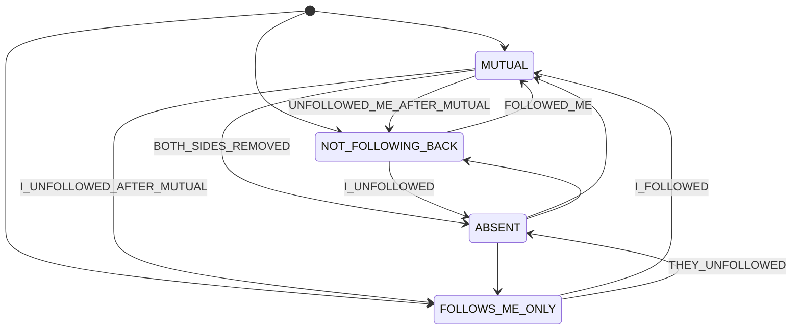
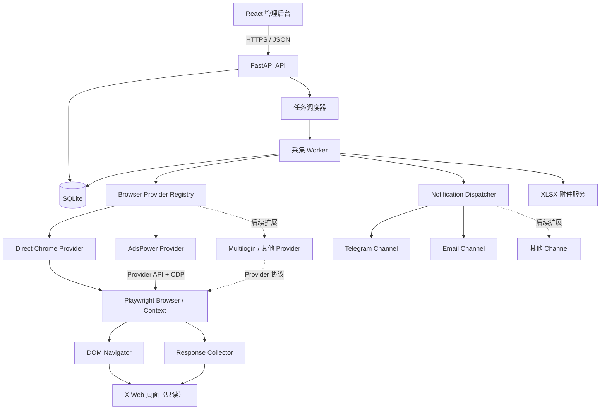

# 多模块监控系统——X 关注关系监控模块需求文档

> 文档状态：已批准基线 1.3  
> 更新日期：2026-09-13  
> 产品形态：可自托管；SaaS 发布须通过合规评审  
> 后端：Python；前端：React + TypeScript  
> 浏览器自动化：Playwright for Python  
> 数据库：SQLite，业务数据保留 30 天

## 1. 文档目的

本文档定义多模块监控系统的第一个业务模块“X 关注关系监控”的产品范围、采集方式、业务规则、数据结构、后台页面、通知、非功能要求与验收标准，并作为设计、开发、测试和交付的共同基线。

本模块通过用户已登录的浏览器会话，只读采集该 X 账号的 followers（关注该账号的人）与 following（该账号关注的人），在本地或服务端完成快照比对并输出结果。系统不执行关注、取关、拉黑、私信、发帖等 X 写操作。

## 2. 已确认决策

| 项目 | 决策 |
| --- | --- |
| 系统定位 | 可扩展的多模块监控系统，X 关注关系是首个业务模块 |
| 采集方式 | Python 通过可扩展 Browser Provider 控制真实浏览器；MVP 支持直接 Chrome 与 AdsPower，页面定位负责导航/加载，监听页面自然产生的网络响应提取数据 |
| 浏览器框架 | Playwright for Python |
| 后端 | Python 3.12+、FastAPI、SQLAlchemy 2、Alembic |
| 前端 | React、TypeScript、Vite、TanStack Query |
| 数据库 | SQLite；启用 WAL、外键和 busy timeout |
| 调度方式 | 后端定时任务；同一 X 账号同一时间只允许一个采集任务 |
| 数据范围 | 当前监控账号的 followers 与 following 两张完整列表 |
| 数据标识 | X 用户 ID 作为唯一关联键；用户名和显示名只作展示缓存 |
| 数据保留 | 原始快照、比对事件、任务记录、附件和通知记录保留 30 天 |
| 通知 | 可扩展 Notification Channel；MVP 实现 Telegram 与邮件，正文给摘要，详细结果放 XLSX 附件 |
| 管理端 | React + TypeScript 后台页面 |
| X 操作边界 | 只读采集和输出结果，不执行任何关系或内容写操作 |

### 2.1 目标用户与权限角色

- 主要用户：管理本人 X 关系的个人或小团队，且对被绑定账号具有合法使用权。
- `OWNER`：可绑定/解绑账号、配置调度与通知、管理名单、查看与删除本人数据。
- `OPERATOR`：可发起扫描、查看结果和处理事件，不可解绑账号、更换会话或修改密钥类配置。
- `VIEWER`：仅可查看授权账号的任务与结果，不可触发扫描或变更规则。
- MVP 自托管可只实现 `OWNER`，但 API 授权边界不得假设“所有登录用户都是管理员”，为后续多用户保留资源所属校验。

### 2.2 需求优先级与 MVP 边界

| 级别 | 含义 | 本文档范围 |
| --- | --- | --- |
| P0 | 缺失则不可交付 | 直接 Chrome/AdsPower 会话绑定、完整扫描、快照事务、关系比对、失败关闭、本地后台查看、XLSX 下载、权限隔离 |
| P1 | 可用版必须具备 | 周期调度、Telegram/邮件、名单规则、审计、30 天清理、可观测性 |
| P2 | 后续增强 | 多角色界面、多模块统一平台、PostgreSQL 迁移、SaaS 能力 |

除非专项评审变更，默认交付口径为“阶段 A 的全部 P0 需求”；P1/P2 不得反向破坏 P0 的数据模型和安全边界。

## 3. 重要合规边界

X 当前服务条款与开发者规范对未经许可的自动化访问、抓取及浏览器自动化存在明确限制。因此：

1. 自托管版本也应由使用者确认其有权处理目标账号数据并承担账号风险。
2. SaaS 版在公开销售或规模化运行前，必须完成法律/平台条款评审，并优先取得 X 的书面许可；未通过前不得作为正式商用采集能力发布。
3. 系统不得绕过 CAPTCHA、登录验证、访问限制或其他安全控制。
4. 系统不得包含 stealth 插件、指纹伪造、验证码代答、代理池轮换或规避限速功能。
5. 遇到挑战页、账号锁定、强制验证或异常限流时，任务立即停止并标记为“需要用户处理”。
6. 不记录 X 密码，不从其他浏览器窃取 Cookie，不向用户未授权的第三方传递登录态。
7. 采集适配器只能观察当前浏览器页面自然产生的响应；不得把页面内部接口当作稳定公开 API 对外承诺。
8. AdsPower 或其他 Browser Provider 集成只用于会话/profile 编排；本系统不创建或轮换指纹、代理、身份模板，不以此规避 X 的检测、限速或安全控制。

工具选型不会改变上述合规风险；Playwright 仅是工程实现选择。

## 4. 产品目标与非目标

### 4.1 产品目标

- 定期获得监控账号完整的 followers 与 following 列表。
- 保存每次成功采集的快照，并与上一次成功完整快照比较。
- 找出当前“我关注、但未关注我”的账号。
- 找出“上次互关、本次对方已取消关注我”的账号，放入待处理列表。
- 找出“当前我仍关注业务黑名单中的账号”，作为规则冲突放入待处理列表。
- 记录长期未回关账号连续出现的有效扫描次数。
- 支持用户将账号加入白名单或业务黑名单。
- 将每次采集、比对和处理摘要通过后台和用户启用的 Notification Channel 呈现；MVP 渠道为 Telegram 与邮件。
- 为以后新增其他监控模块复用账户、调度、通知、附件和审计能力。

### 4.2 明确不做

- 不自动或手动代理用户执行关注、取关、拉黑、取消拉黑。
- 不发送 X 私信、提及或站内原生通知。
- 不遍历 following 中每个账号，再获取这些账号各自的 followers/following。
- 不监控未获授权的第三方私有数据。
- 不保证在 X 页面或内部响应结构变化后无需升级即可继续工作。
- MVP 不提供浏览器扩展；未来扩展只能做结果展示或关注前提示，不能冒充 X 原生通知。

## 5. 关键概念和业务规则

设本次完整扫描得到：

- `F`：followers 的用户 ID 集合，即关注我的人。
- `G`：following 的用户 ID 集合，即我关注的人。

则：

| 状态 | 集合表达式 | 含义 |
| --- | --- | --- |
| 互关 | `F ∩ G` | 双方互相关注 |
| 未回关 | `G - F` | 我关注对方，对方未关注我 |
| 只关注我 | `F - G` | 对方关注我，我未关注对方 |

### 5.1 首次扫描

- 首次扫描仅建立基线，不产生任何关系变化事件，特别是不产生“刚刚取关我”的结论。
- 可以输出当前互关、未回关和只关注我的现状。
- 首次扫描完成后，未回关账号的连续计数记为 1。

### 5.2 对方取消关注事件

用户 `u` 同时满足以下条件时，生成 `UNFOLLOWED_ME_AFTER_MUTUAL` 事件：

- 上一次成功完整快照中：`u ∈ F_prev ∩ G_prev`；
- 本次成功完整快照中：`u ∈ G_curr - F_curr`。

该事件进入“待处理”列表。这里的“业务黑名单”仅为本系统内的标记，不调用 X 拉黑接口。

事件生成必须幂等：同一 `scan_run_id + subject_x_user_id + event_type` 最多一条。任务重试、worker 重启或通知重试不得重复生成业务事件。

### 5.3 连续未回关计数

- 若 `u ∈ G_curr - F_curr`，则 `non_followback_streak += 1`。
- 若 `u ∈ F_curr`、`u ∉ G_curr`，或本次扫描无效，则计数清零或保持，具体如下：
  - 已回关：清零；
  - 我已不再关注：关闭该状态并清零；
  - 扫描失败或不完整：保持原值，不递增。
- 达到用户配置阈值时触发提醒；默认阈值为连续 3 次成功扫描。
- 阈值提醒默认仅在计数从阈值以下跨越到阈值时发送一次；可选的持续提醒间隔默认为每 7 次后续成功扫描，避免每次扫描重复轰炸。
- 将账号加入白名单会抑制后续提醒，但不改写已发生的关系事实或历史事件。

### 5.4 白名单与业务黑名单

- 白名单：即使长期未回关，也不触发待处理提醒；仍保留关系事实和扫描记录。
- 业务黑名单：表示用户不希望当前或未来关注该账号，用于后台标记、待处理冲突、通知和导出；系统仍不代理用户执行取关。
- 同一账号不可同时存在于白名单和业务黑名单；后一次操作必须要求用户先解除冲突状态。
- 所有名单变更记录操作人、时间、原因和变更前后值。

### 5.5 关系状态机与事件口径

对每个 `subject_x_user_id`，每次成功完整扫描后将其归入四种事实状态之一：

| 状态 | 判定 | 说明 |
| --- | --- | --- |
| `MUTUAL` | `u ∈ F ∩ G` | 互关 |
| `NOT_FOLLOWING_BACK` | `u ∈ G - F` | 我关注对方，对方未关注我 |
| `FOLLOWS_ME_ONLY` | `u ∈ F - G` | 对方关注我，我未关注对方 |
| `ABSENT` | `u ∉ F 且 u ∉ G` | 本次两侧都不存在；仅作状态迁移和历史收口，不写入快照成员 |



- `UNFOLLOWED_ME_AFTER_MUTUAL` 是待处理事件；`NEW_FOLLOWER`、`LOST_FOLLOWER`、`NEW_FOLLOWING`、`REMOVED_FOLLOWING` 是普通变化事件，用于统计、展示和导出。
- 同一次迁移可同时对应一个业务事件和一个普通变化事件，但统计指标必须按事件类型计数，不得把两者相加为“取消关注人数”。
- 用户名变更、显示名变更、头像变更不构成关系事件；仅更新展示缓存。

### 5.6 重点待处理项

设 `B` 为当前账号的业务黑名单 X 用户 ID 集合。系统至少维护下列两类高优先级待处理项：

| 类型 | 触发条件 | 解决条件 | 默认通知 |
| --- | --- | --- | --- |
| `UNFOLLOWED_ME_AFTER_MUTUAL` | 上次 `MUTUAL`，本次 `NOT_FOLLOWING_BACK` | 后续不再处于 `NOT_FOLLOWING_BACK` | 新事件立即通知 |
| `FOLLOWING_BLOCKLISTED_ACCOUNT` | `u ∈ G ∩ B`，即当前仍关注黑名单账号 | `u ∉ G` 或用户移除该黑名单规则 | 首次检出立即通知 |

- `FOLLOWING_BLOCKLISTED_ACCOUNT` 是规则冲突，不是关系变化事件，因此首次基线扫描也可生成它，不违反“首次扫描不生成关系变化事件”的规则。
- 新增业务黑名单规则时，若最新成功快照显示 `u ∈ G`，立即创建待处理项并通知，同时显示快照时间；若没有成功快照，则提示用户先扫描。
- 已持续存在的待处理项不在每次扫描重复通知；可选持续提醒间隔默认为每 7 次成功扫描。
- 本模块的发现时点是完整扫描后，不能在 X 页面的关注按钮点击前实时拦截；实时关注前提示属于未来浏览器扩展范围。

## 6. 为什么选择 Playwright

### 6.1 选型结论

采用 Playwright for Python，不采用 Selenium 作为主实现。

| 维度 | Playwright | Selenium | 本项目结论 |
| --- | --- | --- | --- |
| 动态页面等待 | Locator 与动作自带可操作性等待和重试 | 通常需要较多显式等待管理 | Playwright 更适合 X 的 SPA 与无限滚动 |
| 网络响应监听 | 原生 request/response 事件与上下文级监听 | 可通过 WebDriver BiDi/CDP 实现，但工程接线更繁琐 | Playwright 更直接 |
| 会话隔离 | BrowserContext 是一等能力 | 可通过独立 profile/session 实现 | Playwright 更便于一账号一上下文 |
| Python 异步 | 提供完整 async API | 常见用法以同步 WebDriver 为主 | 与 FastAPI/任务工作进程更协调 |
| 故障诊断 | Trace、截图、视频、控制台与网络事件集成较好 | 需要组合多种能力 | Playwright 更利于页面变化后的排障 |
| 既有生态 | 较新 | Selenium Grid 与企业浏览器农场生态成熟 | 本项目无既有 Grid 约束 |

Selenium 只有在已有 Selenium Grid、企业统一 WebDriver 基础设施或必须复用既有 Selenium 测试资产时更合适。本项目从零开发，且核心难点是动态列表导航、响应监听、会话隔离和故障追踪，Playwright 的综合成本更低。

### 6.2 选型不代表什么

- 不代表 Playwright 能规避平台检测或条款限制。
- 不把 CSS class 或混淆后的内部接口名硬编码为长期契约。
- 不承诺页面变更后永不维护。

## 7. 总体架构



### 7.1 组件边界

- `platform-core`：用户、模块注册、调度、通知、附件、审计、系统配置。
- `x-relationship-module`：X 会话、页面导航、响应解析、快照验证、关系比对、名单规则。
- `browser-provider`：封装浏览器 profile 的启动、连接、健康检查、断开与能力声明，不包含 X 业务解析逻辑。
- `notification-channel`：封装渠道配置验证、测试投递、摘要/附件投递、错误分类与能力声明。
- `api-service`：提供管理端 API，不直接启动长时间浏览器任务。
- `worker`：执行浏览器采集、比对、附件生成和通知投递。
- MVP 可单机部署，但 API 与 worker 保持逻辑和进程边界，便于以后拆分。

### 7.2 Browser Provider 扩展契约

每个 Browser Provider 必须实现统一的逻辑契约，使 X 采集器只依赖 Playwright `Browser/BrowserContext/Page` 能力，不依赖 AdsPower 或其他工具的专用字段。

| 能力 | 要求 |
| --- | --- |
| `validate_config` | 验证 provider 类型、profile 引用、API/CDP 连通性和所需能力，不回传密钥 |
| `acquire` | 获取 profile 级互斥锁；必要时由 provider 启动浏览器，返回统一会话句柄 |
| `connect` | 直接启动 Chrome 或通过受信 CDP 端点连接，向上层提供可用的 Playwright context |
| `health_check` | 检查浏览器进程、context/page 可用性与当前 profile 一致性 |
| `release` | 释放锁和连接；只有本次任务启动的浏览器/profile 才可由本任务关闭 |
| `capabilities` | 声明是否支持持久 profile、可见登录、远程 CDP、附加现有会话等能力 |

- Provider 通过注册表和稳定 `provider_code` 加载，不在 X 采集业务代码中使用 `if AdsPower / if Multilogin` 分支。
- 新 Provider 必须通过共享契约测试后才可注册；其专用配置保存在版本化 `config_json`，密钥仅保存 secret reference。

### 7.3 MVP Provider 能力矩阵

| 能力 | Direct Chrome | AdsPower | 后续 Provider |
| --- | --- | --- | --- |
| profile 来源 | 系统创建并管理独立 `user-data-dir` | 列出并选择已有 AdsPower profile | 由适配器声明 |
| 启动 | Playwright 启动已安装的 Google Chrome | 通过 AdsPower Provider API 启动选定 profile | 由适配器实现 |
| 连接 | 直接获得 BrowserContext | 从 Provider API 结果获取受信 CDP 信息后连接 | 优先转换为 Playwright context |
| 释放 | 任务释放 context；按会话策略保留 profile | 若本任务启动 profile，则任务后可调 Provider API 停止；否则仅断开 | 必须遵循启动所有权 |
| profile 创建/删除 | 支持创建；解绑时按删除策略处理 | MVP 不代理创建/删除 AdsPower profile | 作为可选能力单独评审 |

MVP 的 AdsPower 集成范围是“配置连接、列出/选择 profile、启动、取得连接、健康检查、按所有权停止”；不在 AdsPower 中自动创建、修改指纹或删除 profile。

## 8. 浏览器登录与会话管理

### 8.1 首次绑定

1. 用户在后台选择“绑定 X 账号”。
2. 用户选择 Browser Provider：`DIRECT_CHROME` 或 `ADSPOWER`；Direct Chrome 创建独立 profile，AdsPower 选择已有 profile。
3. 系统通过 Provider 启动或连接可见浏览器，并获得该账号专属的持久化 BrowserContext。
4. 用户直接在 X 页面手工登录；系统不提供 X 密码输入框。
5. 登录成功后，读取当前账号稳定 X 用户 ID 与展示信息，请用户确认。
6. 保存 Provider 类型、profile 引用和加密后的会话/Provider 密钥引用。
7. 执行一次只读连通性测试。

### 8.2 会话要求

- 每个系统用户、每个 X 账号使用逻辑隔离的 context/profile；Direct Chrome 使用独立存储目录，外部 Provider 使用其管理的独立 profile。
- 一个 X 账号绑定一个 Browser Provider profile；同一 profile 不得同时被多个采集任务占用，即使它被误配置到不同 X 账号。
- `DIRECT_CHROME` 使用受保护的独立 `user-data-dir`，不复用用户日常 Chrome 主 profile；`ADSPOWER` 使用指定 AdsPower profile ID，由适配器通过配置的 Provider API 启动并获取 CDP 连接信息。
- AdsPower 等 Provider API 端点必须来自管理员许可列表，默认仅允许 loopback/私有网络；用户不得在任务请求中提交任意 CDP/API URL，避免 SSRF 和跨租户会话接管。
- 会话密钥不得写入日志、XLSX 或前端响应。
- SaaS 环境的会话材料必须在服务端静态加密；密钥不得与数据库同库存储。
- 用户可主动解绑；解绑后删除相应会话材料，但保留期内的审计数据按策略处理。
- 登录过期时状态改为 `REAUTH_REQUIRED`，停止后续计划任务并通知用户。

### 8.3 部署与网络边界

- Direct Chrome worker 需要可启动可见 Google Chrome 的桌面/虚拟显示环境。
- AdsPower 运行在宿主机而 worker 运行在容器时，只允许通过明确配置的宿主网关访问 Provider API/CDP；不得为便于连接而将这些端口公开到互联网。
- MVP 只支持 worker 可直接访问浏览器/Provider 的自托管部署。SaaS 连接用户本机 AdsPower 需额外的本地代理和双向身份验证，不属于当前范围。

## 9. 数据采集需求

### 9.1 采集对象

每次扫描只采集当前绑定账号的两组数据：

1. 该账号的完整 followers 列表；
2. 该账号的完整 following 列表。

每条成员记录至少包含：

- `x_user_id`：必填，X 系统稳定用户 ID；
- `username`：可空，展示缓存，可被用户修改；
- `display_name`：可空，展示缓存；
- `avatar_url`：可空，仅用于短期展示；
- `relationship_type`：`FOLLOWER` 或 `FOLLOWING`；
- `observed_at`：本次观察时间。

### 9.2 采集策略

- 页面定位器负责打开绑定账号主页、进入 followers/following 页、触发滚动和下一批加载。
- Response Collector 在导航前注册监听器，只接收该页面会话自然产生的响应。
- 解析器从响应载荷提取用户 ID 和展示字段；DOM 文本仅用于导航、状态确认和必要的降级校验。
- 不依赖显示名判断身份；数据库比较只使用 `x_user_id`。
- 不在需求文档中固化 X 内部 endpoint、query hash 或响应字段路径；适配器实现必须版本化并可通过夹具测试升级。

### 9.3 完整性判定

一次扫描必须同时满足以下条件才可提交：

- followers 与 following 两侧均到达分页终点或明确的无下一页状态；
- 未发生登录失效、挑战页、权限错误或不可解释的解析异常；
- 本次提取记录的用户 ID 均非空且集合内已去重；
- 页面显示总数可获得时，与提取数量进行容差校验；差异超出配置阈值则失败；
- 解析器识别本次响应结构版本；未知结构必须失败关闭，不能把空列表当作真实结果。

采集过程先写临时表。只有整次扫描完整时，才在一个数据库事务中提升为正式快照。失败或中断的临时数据不得参与比对。

完整性校验的默认参数如下，部署可收紧但不得关闭：

| 检查 | 默认阈值 | 失败结果 |
| --- | --- | --- |
| 重复分页游标 | 同一 cursor 重复 2 次且无新 ID | `INCOMPLETE_SUSPECTED` |
| 连续空载荷 | 非终点响应连续 2 页无可识别用户 | `PARSER_CHANGED` |
| 页面精确总数差异 | 仅当页面给出未缩写整数时校验；差值大于 `max(20, 页面总数 × 2%)` | `INCOMPLETE_SUSPECTED` |
| 相比上次快照骤降 | 任一侧同时减少至少 50 个且超过 20% | `INCOMPLETE_SUSPECTED` |
| 无法识别的列表条目 | 超过已读取条目的 1% 或累计 10 条 | `PARSER_CHANGED` |

- 空账号只有在明确收到分页终点且页面确认列表为空时才可提交零记录快照。
- 触发骤降规则后不自动覆盖基线；用户手工重试或下一次调度重试。连续两次独立完整采集得到相同集合时，第二次可作为新快照提交，并在任务中标记“异常降幅已复核”。

### 9.4 异常与重试

| 异常 | 行为 |
| --- | --- |
| 网络短暂中断/页面超时 | 指数退避重试，默认最多 3 次 |
| 登录失效 | 标记 `REAUTH_REQUIRED`，不自动输入凭据 |
| CAPTCHA/挑战页/账号锁定 | 标记 `NEEDS_USER_ACTION`，立即停止 |
| 页面或响应结构变化 | 标记 `PARSER_CHANGED`，保存脱敏诊断信息，停止提交 |
| 数据显著异常减少 | 标记 `INCOMPLETE_SUSPECTED`，不得产生取消关注事件 |
| 任务进程崩溃 | 下次启动清理超时临时数据，保留失败任务摘要 |

## 10. 调度与并发

- 支持手工扫描与周期扫描。
- 默认周期为每天一次，可配置，但最短周期默认不低于 6 小时。
- 系统应加入小幅随机抖动，避免所有本地任务同一秒启动；该机制仅用于资源调度，不用于规避平台限制。
- 同一 X 账号使用互斥锁，禁止并发扫描。
- 同一 `provider_code + provider_profile_ref` 也使用互斥锁；账号锁与 profile 锁均获取成功后才可启动/连接浏览器，并按固定顺序获取以避免死锁。
- 单机 SQLite 部署默认仅运行一个写入 worker；多个采集任务可受控并发，但数据库写入串行化。
- 若上一次任务仍在运行，新计划任务记为 `SKIPPED_ALREADY_RUNNING`。
- 用户可暂停账号或全局暂停采集。
- 周期配置以 IANA 时区保存；夏令时跳过的本地时刻不补跑，重复的本地时刻只运行一次。
- 手工扫描返回已创建的任务 ID，不同步等待扫描完成；对同一账号重复点击应由幂等键或短时去重防止创建多个排队任务。
- 正在 `REAUTH_REQUIRED` 或 `NEEDS_USER_ACTION` 的账号不创建计划扫描任务；仅在用户完成重新验证并通过连通性测试后恢复。

## 11. 数据模型

除明确声明复合主键的关联/快照表外，实体表使用内部 UUID/ULID 主键；时间统一保存 UTC，前端按用户时区显示。

### 11.1 核心表

#### `users` 与 `x_account_memberships`

- `users`：`id`, `email_or_login`, `status`, `timezone`, `created_at`, `updated_at`。
- `x_account_memberships`：`x_account_id`, `user_id`, `role`, `created_at`, `updated_at`；复合主键 `(x_account_id, user_id)`，`role` 为 `OWNER`、`OPERATOR` 或 `VIEWER`。
- MVP 每个 X 账号至少且仅需一个 `OWNER`；多用户界面可后置，但资源所属约束和授权查询必须保留。

#### `modules`

- `id`, `code`, `name`, `enabled`, `config_json`, `created_at`, `updated_at`

#### `x_accounts`

- `id`, `owner_user_id`, `x_user_id`, `username`, `display_name`
- `browser_provider_code`, `browser_provider_config_id`, `browser_profile_ref`, `browser_provider_config_version`
- `session_status`, `enabled`
- `last_successful_scan_at`, `created_at`, `updated_at`
- 唯一约束：`(owner_user_id, x_user_id)`
- 唯一约束：`(browser_provider_config_id, browser_profile_ref)`，防止同一 Provider profile 同时绑定多个 X 账号。

#### `scan_runs`

- `id`, `x_account_id`, `trigger_type`, `status`
- `started_at`, `finished_at`, `parser_version`, `browser_provider_code`, `browser_provider_version`, `external_provider_version`
- `followers_count`, `following_count`
- `added_followers_count`, `removed_followers_count`, `non_followback_count`
- `error_code`, `error_summary`, `diagnostic_artifact_id`

#### `relationship_snapshots`

- `id`, `scan_run_id`, `x_account_id`, `captured_at`, `is_complete`
- `followers_count`, `following_count`

#### `snapshot_memberships`

- `snapshot_id`, `x_user_id`, `is_follower`, `is_following`
- `username`, `display_name`, `avatar_url`, `observed_at`
- 主键：`(snapshot_id, x_user_id)`
- 索引：`(x_user_id)`, `(snapshot_id, is_follower, is_following)`

#### `relationship_states`

- `x_account_id`, `subject_x_user_id`, `current_state`
- `non_followback_streak`, `first_seen_at`, `last_seen_at`
- `last_mutual_at`, `last_unfollowed_me_at`
- 主键：`(x_account_id, subject_x_user_id)`

#### `relationship_events`

- `id`, `x_account_id`, `scan_run_id`（可空）, `subject_x_user_id`
- `event_category`, `event_type`, `source_type`, `source_id`, `dedupe_key`
- `previous_state`, `current_state`, `detected_at`, `last_seen_at`, `resolved_at`
- `status`：`NEW`, `ACKNOWLEDGED`, `RESOLVED`
- 唯一约束：`dedupe_key`；扫描事件的键包含 `scan_run_id + subject_x_user_id + event_type`，规则变更事件的键包含 `rule_change_id + subject_x_user_id + event_type`。
- `ACKNOWLEDGED` 表示用户已看到事件；`UNFOLLOWED_ME_AFTER_MUTUAL` 在主体不再处于 `NOT_FOLLOWING_BACK` 时自动解决，`FOLLOWING_BLOCKLISTED_ACCOUNT` 在主体不再属于 `G ∩ B` 时自动解决。转为 `RESOLVED` 不删除历史事件。
- 对同一账号和主体，同一 `event_type` 同时最多存在一条未解决事件；持续命中只更新 `last_seen_at`，解决后再次发生则开启新 episode。

#### `account_rules`

- `id`, `x_account_id`, `subject_x_user_id`, `rule_type`
- `reason`, `created_by`, `created_at`, `updated_at`
- `rule_type`：`ALLOWLIST` 或 `BUSINESS_BLOCKLIST`
- 唯一约束：`(x_account_id, subject_x_user_id)`

#### `notification_intents` 与 `notification_deliveries`

- `notification_intents`：`id`, `scan_run_id`（可空）, `notification_kind`, `title`, `plain_text`, `html`, `metadata_json`, `artifact_id`, `created_at`。
- `notification_deliveries`：`id`, `notification_intent_id`, `channel_code`, `channel_config_id`, `recipient_ref`, `channel_version`, `status`, `attempt_count`, `sent_at`, `error_summary`。
- 唯一约束：`(notification_intent_id, channel_config_id, recipient_ref)`。
- 测试通知、账号会话故障等不属于成功扫描的意图可使用空 `scan_run_id`，但仍必须拥有唯一 intent ID 作为幂等根。

#### `artifacts`

- `id`, `scan_run_id`, `type`, `storage_path`, `sha256`, `size_bytes`
- `created_at`, `expires_at`, `deleted_at`

#### `audit_logs`

- `id`, `actor_type`, `actor_id`, `action`, `target_type`, `target_id`
- `before_json`, `after_json`, `created_at`

#### 补充支撑表

- `browser_provider_configs`：`id`, `owner_scope`, `provider_code`, `display_name`, `config_version`, `config_json`, `secret_ref`, `enabled`, `created_at`, `updated_at`；API/CDP 端点由此受控配置生成，不接受任务级任意 URL。
- `notification_channel_configs`：`id`, `owner_scope`, `channel_code`, `display_name`, `config_version`, `config_json`, `secret_ref`, `enabled`, `created_at`, `updated_at`；具体密钥和出站端点受控保存。
- `scan_staging_memberships`：按 `scan_run_id + relationship_type + x_user_id` 临时存放采集结果，仅成功提交时转为正式快照。
- `schedule_settings`：账号级周期、IANA 时区、抖动窗口、启停状态和下次运行时间。
- `notification_settings`：账号/用户级渠道、收件目标引用、事件偏好和“无变化通知”开关；敏感凭据只保存密钥引用。
- `user_consents`：记录合规提示版本、同意人、同意时间和撤回时间，作为启用采集的前置条件。

### 11.2 SQLite 配置

- 启用 `PRAGMA foreign_keys=ON`。
- 启用 WAL 模式和合理的 `busy_timeout`。
- 所有正式快照提交和状态更新必须处于事务内。
- 使用 Alembic 管理版本，不允许生产环境启动时隐式破坏性迁移。
- SaaS 用户量、账号量或并发写入超过 SQLite 能力后迁移 PostgreSQL；业务层不得依赖 SQLite 私有语法。

### 11.3 状态字段边界

- `scan_runs.status`：`QUEUED`、`RUNNING`、`SUCCESS`、`FAILED`、`SKIPPED_ALREADY_RUNNING`、`CANCELLED`。
- `x_accounts.session_status`：`UNBOUND`、`READY`、`REAUTH_REQUIRED`、`NEEDS_USER_ACTION`、`DISABLED`。
- `scan_runs.error_code` 承载 `PARSER_CHANGED`、`INCOMPLETE_SUSPECTED`、`NETWORK_TIMEOUT`、`BROWSER_CRASH`等可操作的失败原因，不将原因与任务生命周期混在同一枚举中。
- 状态迁移采用条件更新或版本号；终态任务不得被迟到 worker 回写为 `RUNNING`。

## 12. 30 天数据保留策略

- 保留范围：扫描任务、正式与临时快照、成员记录、关系事件、通知记录、XLSX、截图/trace 等诊断附件、审计记录。
- 每日执行一次清理任务，删除 `created_at/captured_at < 当前时间 - 30 天` 的数据。
- 删除顺序应尊重外键；附件先标记、删除物理文件，再更新 `deleted_at`，最终清理元数据。
- 未完成临时数据默认 24 小时后清理。
- 数据库备份、对象存储副本和日志也必须遵守最长 30 天，不能因备份无限延长保留期。
- 白名单、业务黑名单、账号配置属于持续配置，不因 30 天到期删除；用户解绑或删除账号时按产品删除流程处理。
- 由于只保留 30 天，连续次数基于保留期内成功扫描；若需要长期连续统计，只保留聚合后的当前计数，不保留过期原始成员明细。
- 保留期从各数据的业务产生时间起算，不因查看、导出或通知重试而延长。
- 清理任务每日至少执行一次，验收容差为“到期后 24 小时内不再可从业务 API 或附件路径访问”。
- 审计与合规证据如依法需超过 30 天保留，必须在 SaaS 合规评审中单独定义法律依据、字段最小化和保留期；在该评审通过前仍执行 30 天上限。

### 12.1 解绑与用户主动删除

- 解绑立即停止新调度、取消未开始任务，并在安全停止点终止运行中采集。
- 会话状态、系统管理的 Direct Chrome profile 与可用于恢复登录的密钥材料在解绑完成时立即删除，不进入 30 天缓冲期。对 AdsPower 等外部管理 profile，系统只删除本地引用/密钥，默认不删除外部 profile。
- 用户选择“同时删除历史数据”时，关系快照、事件、规则、附件和通知记录在 24 小时内从业务界面与主存储删除；否则仅按原 30 天到期策略保留只读历史。
- 删除请求本身只保留最小审计证据，不保留 X 用户名、显示名或关系明细。

## 13. 通知与附件

### 13.1 MVP 通知渠道

- Telegram Bot：消息摘要 + XLSX 文档附件。
- 邮件：HTML/纯文本摘要 + XLSX 附件。
- 后台站内记录：保留本次结果和投递状态。

### 13.2 Notification Channel 扩展契约

- 渠道通过稳定 `channel_code` 注册；核心调度和 X 模块只产生渠道无关的通知意图，不直接调用 Telegram/SMTP SDK。
- 每个渠道实现 `validate_config`、`send`、`classify_error`、`capabilities`；其中 `capabilities` 声明文本长度、HTML、附件数量/大小、链接和格式限制。
- 通用模板先生成规范化 `title`、`plain_text`、`html`、`artifact_refs`和 `metadata`；适配器根据能力降级，例如无附件能力时发送有时效的后台下载链接。
- 后续新增 Webhook、Slack、Discord 等渠道时，不得修改扫描、快照、关系比对或事件生成逻辑；新渠道必须通过共享契约测试。

### 13.3 通知触发

- 每次成功扫描完成后通知，可由用户关闭“无变化通知”。
- 出现新 `UNFOLLOWED_ME_AFTER_MUTUAL`、新 `FOLLOWING_BLOCKLISTED_ACCOUNT` 或连续未回关达到阈值时必须通知。
- “必须通知”表示始终创建后台站内记录，并通过用户已启用且配置有效的所有外部渠道投递；未配置外部渠道不阻断扫描。
- 登录失效、挑战页、解析器变化、连续任务失败时发送故障通知。
- 通知失败不回滚扫描结果；按渠道独立重试，默认最多 3 次。
- 同一 `notification_intent_id + channel_config_id + recipient_ref` 只创建一个投递记录；重试更新原记录，不重复创建通知。
- 重试间隔默认为 1、5、30 分钟并加小幅抖动；凭据错误、收件人无效等永久错误不重试，但要在后台标明可采取的修复动作。

### 13.4 正文摘要

- 账号、扫描时间、扫描状态与耗时。
- followers/following 总数。
- 新增关注我的人数、取消关注我的人数。
- 当前未回关人数、新达到提醒阈值人数。
- “之前互关、现在仅我单向关注”的新增人数与账号摘要。
- 白名单/业务黑名单命中数，以及“当前仍关注黑名单账号”的新增和未解决数。
- 管理后台本次任务详情链接。

### 13.5 XLSX 附件

附件至少包含以下工作表：

1. `Summary`：任务与统计摘要；
2. `UnfollowedMe`：上次互关、本次取消关注我的账号；
3. `BlocklistConflicts`：当前仍在 following 中的业务黑名单账号，包含规则原因、首次/最近命中时间和处理状态；
4. `NonFollowers`：当前我关注但未关注我的账号及连续次数；
5. `NewFollowers`：本次新关注我的账号；
6. `Followers`：本次完整 followers；
7. `Following`：本次完整 following；
8. `Rules`：本次命中的白名单/业务黑名单。

每个账号行至少包含稳定 X ID、username、显示名、关系状态、连续次数、首次/最近发现时间和规则状态。附件不包含 Cookie、token、密码或内部诊断载荷。

X 用户名、显示名和规则原因等外部/用户输入写入 XLSX 前必须防止公式注入；以 `=`、`+`、`-`、`@` 开头的文本按纯文本写入。

## 14. 后端 API

统一前缀建议为 `/api/v1`。

| 方法与路径 | 用途 |
| --- | --- |
| `GET /browser-providers` | 查询已注册 Provider 及能力，MVP 返回 Direct Chrome 与 AdsPower |
| `GET/POST/PUT /browser-provider-configs` | 管理受控 Provider 配置和密钥引用 |
| `POST /browser-provider-configs/{id}/test` | 执行不泄露端点/密钥的连通性与能力检查 |
| `POST /x-accounts/bind-session` | 使用 `provider_config_id + profile_ref` 创建待登录浏览器会话 |
| `GET /x-accounts` | 查询已绑定账号 |
| `POST /x-accounts/{id}/scan-runs` | 发起手工扫描 |
| `POST /x-accounts/{id}/pause` | 暂停计划任务 |
| `POST /x-accounts/{id}/resume` | 恢复计划任务 |
| `DELETE /x-accounts/{id}` | 解绑账号并执行删除策略 |
| `GET /scan-runs` | 分页查询任务 |
| `GET /scan-runs/{id}` | 查询任务详情与统计 |
| `GET /scan-runs/{id}/artifacts` | 获取有权限的附件下载地址 |
| `GET /relationships` | 查询当前关系状态 |
| `GET /relationship-events` | 按账号、`event_category`、`event_type`、`status` 查询关系变化与规则冲突事件 |
| `POST /relationship-events/{id}/acknowledge` | 确认已查看待处理事件，不改写关系事实或自动解决条件 |
| `POST /account-rules` | 添加白名单或业务黑名单 |
| `DELETE /account-rules/{id}` | 删除名单规则 |
| `GET /notification-channels` | 查询已注册渠道及能力 |
| `GET/PUT /notification-settings` | 查询/修改按 `channel_code` 区分的通知设置 |
| `POST /notification-settings/{id}/test` | 使用对应 Channel Adapter 测试指定通道 |

所有列表 API 必须分页、限制最大页大小，并按系统用户和 X 账号实施授权隔离。附件下载使用短期授权，不暴露物理路径。

### 14.1 API 通用契约

- JSON 错误使用统一结构：`code`、`message`、`request_id`、`details`；`message` 不回传堆栈、物理路径或敏感响应片段。
- 列表默认每页 50 条，最大 200 条；扫描和事件类列表使用稳定排序键的 cursor 分页，避免新数据写入时重复或遗漏。
- 创建扫描和其他可重试的 POST 请求支持 `Idempotency-Key`，键在同一所有者与资源范围内至少保留 24 小时。
- 资源不存在和无权访问对非管理用户统一返回 404，避免泄露其他用户的账号或任务 ID。
- 解绑、删除、规则冲突等状态变更支持乐观并发控制；版本不匹配返回 409，前端必须刷新后让用户重新确认。

## 15. React 管理后台

### 15.1 页面

1. **总览**：绑定账号状态、最后成功扫描、关键统计、最近异常；首屏显示“互关后取消关注”与“关注黑名单账号”的新增/未解决数并链接到待处理页。
2. **X 账号管理**：选择 Direct Chrome/AdsPower Provider 与 profile，绑定、重新登录、连通性测试、暂停、恢复、解绑、周期配置。
3. **扫描任务**：任务状态、耗时、数量、错误、重试和附件。
4. **关系结果**：互关、未回关、只关注我，支持搜索、筛选、排序和导出。
5. **重点待处理**：分为“之前互关、现在仅我单向关注”和“当前仍关注黑名单账号”两个明确分组，展示新增/未解决数、检出时间、规则原因、最新关系状态及确认/解决状态。
6. **白名单/业务黑名单**：添加、移除、原因和审计记录。
7. **通知设置**：根据已注册 Channel Adapter 动态展示配置；MVP 包含 Telegram、SMTP、触发偏好与测试发送。
8. **系统与合规**：保留期、清理状态、版本、风险提示和用户确认记录。

### 15.2 状态展示

- 前端必须分层展示任务生命周期、账号会话状态和失败原因，枚举以第 11.3 节为准；不得把 `PARSER_CHANGED` 等错误原因当作任务生命周期状态。
- 不得把失败扫描的零记录显示为“当前没有 followers/following”。
- 破坏性配置操作和解绑需要二次确认；规则操作支持撤销或明确的删除提示。

## 16. 安全与隐私

- 管理后台必须鉴权；SaaS 使用租户级数据隔离，自托管也不得默认无密码暴露到公网。
- 全链路 HTTPS；Telegram token、SMTP 凭据和会话加密密钥使用密钥存储或环境注入。
- 日志对 Cookie、Authorization、URL 敏感参数、邮箱和 token 脱敏。
- Playwright trace、截图和响应诊断默认关闭；仅故障时按最小范围保存，并在 30 天内删除。
- 浏览器 profile 目录权限限制为运行服务的系统账号。
- AdsPower 或其他 Provider 的 API token、profile 识别信息和 CDP 端点按会话敏感数据处理；CDP URL 不记录、不返回前端、不写入审计前后值。
- Browser Provider 和 Notification Channel 的配置只能引用管理员创建的出站端点/密钥；适配器必须实施协议许可、地址范围、重定向、超时和响应大小限制，不得将其变成任意出站请求代理。
- 提供导出、解绑和删除本人数据的入口。
- SaaS 管理员默认看不到用户的具体关系明细；需要支持操作审计与最小权限。
- 所有来自 X 或用户的文本在 React 中按纯文本渲染，禁止未净化的 HTML 注入；外部头像 URL 不得由后端无限制代理抓取。
- 邮件正文不默认嵌入远程头像或跟踪像素；所有附件响应使用安全的 `Content-Disposition`、MIME 类型和防嗅探头。
- 会话材料解密后只在执行采集的受限进程内存中存在，不通过 API、任务队列载荷或异常文本传递。

## 17. 可观测性与运维

- 记录任务成功率、扫描耗时、每页加载耗时、解析失败率、通知成功率和清理结果。
- 健康检查覆盖 API、SQLite 可写性、worker 心跳、浏览器可启动性和磁盘剩余空间。
- 解析器版本、Playwright 版本和浏览器版本必须记录到每次任务。
- Browser Provider 代码/版本、profile 的不可逆诊断标识和 Notification Channel 代码/版本必须记录到相应任务/投递记录，便于定位适配器回归。
- 页面适配器发布支持回滚；新版解析器先用脱敏固定夹具测试，再用于真实账号。
- 磁盘不足时停止新扫描，不得通过删除尚在保留期内的数据静默腾挪。

### 17.1 可量化的非功能基线

以单机 4 CPU、8 GB 内存、SSD、单 worker 作为 MVP 验收环境；浏览器侧耗时受 X 限制，因此性能回归优先使用本地固定夹具。

| 指标 | MVP 基线 |
| --- | --- |
| API 查询响应 | 10 万条快照成员数据下，普通分页/筛选 API 的 p95 不超过 500 ms（不含附件生成） |
| 比对处理 | 每侧 5 万个唯一 X ID 的快照比对与状态更新在 60 秒内完成 |
| 内存 | 单个 worker 处理上述固定夹具时峰值常驻内存不超过 1.5 GB |
| 可恢复性 | 任何步骤强制终止后，已提交的快照仍一致；重启后 10 分钟内标记遗留任务并恢复可调度状态 |
| 清理 | 到期数据在 24 小时内从业务 API 与附件存储中不可访问 |
| 日志 | 100% 任务拥有 `request_id/scan_run_id`、账号内部 ID、解析器/浏览器版本和终态；抽检不得出现会话凭据 |

### 17.2 容量与降级边界

- MVP 官方验证上限为单实例 5 个绑定账号、每个账号每侧 5 万成员、最多 2 个并发浏览器采集，且仍保持 SQLite 单写者。
- 超过验证上限时系统不保证扫描时长，但必须保证不提交部分快照、不丢失前一次成功基线、不因超时产生关系事件。
- 扫描前预检磁盘空间；可用空间低于 2 GB 或预估任务需求的 2 倍时拒绝新任务并告警，阈值可配置。

## 18. 测试要求

### 18.1 单元测试

- 集合关系与状态迁移。
- 首次基线不误报。
- 连续未回关计数、白名单抑制和规则冲突。
- `UNFOLLOWED_ME_AFTER_MUTUAL` 与 `FOLLOWING_BLOCKLISTED_ACCOUNT` 的首次触发、持续去重、确认、自动解决和再次发生新 episode。
- 新增黑名单规则时根据最新快照立即评估，无快照时不伪造冲突。
- 30 天清理边界与时区。
- 响应解析器的正常、缺字段、未知结构和重复用户夹具。
- Browser Provider 与 Notification Channel 的共享契约测试，包括能力声明、敏感值脱敏、短暂/永久错误分类和资源释放。

### 18.2 集成测试

- 用本地模拟页面和固定响应验证导航、分页、响应监听和完整性提交。
- Direct Chrome Provider 用临时独立 profile 完成启动、连接、重连和关闭所有权测试；AdsPower Provider 用本地伪服务和可控 CDP 浏览器验证 profile 启停与连接。
- 将同一 provider profile 绑定到两个测试账号并并发扫描时，第二个任务不得接管或关闭第一个任务的浏览器。
- 中途超时、浏览器崩溃后不得产生正式快照。
- SQLite 并发锁、事务回滚和服务重启恢复。
- Telegram/SMTP 使用测试替身验证正文、附件及重试。
- 注册一个测试 Notification Channel 时，无需修改 X 模块即可接收规范化通知意图，并按其能力对附件进行降级。

### 18.3 端到端测试

- 绑定测试会话 → 完整扫描 → 快照比对 → 后台展示 → XLSX → 通知。
- 发布前分别在实际 Google Chrome 和支持版本的 AdsPower 上执行本地测试页导航、profile 隔离、重启重连和启停所有权冒烟测试；不需要对 X 生产环境执行写操作。
- 登录过期和挑战页必须停在需要用户操作状态。
- 不在自动测试中对 X 生产环境执行写操作。

## 19. 验收标准

| ID | 验收条件 | 优先级 |
| --- | --- | --- |
| AC-01 | 用户可分别通过 Direct Chrome 和 AdsPower 手工登录并绑定 X 账号，系统不提供密码输入、不记录 X 密码，绑定前已记录当前合规提示版本的用户确认。 | P0 |
| AC-02 | 通过固定夹具和请求记录证明，系统只采集该账号自己的 followers/following，不递归请求他人列表，不执行 X 写操作。 | P0 |
| AC-03 | 一次完整扫描可生成包含稳定 X ID 的两侧去重集合，并在单一事务中提交快照、状态和事件。 | P0 |
| AC-04 | 首次扫描只建基线；从第二个成功完整快照起，状态机能对文档列出的迁移和普通变化事件逐一正确处理。 | P0 |
| AC-05 | 失败、中断、未知解析结构或触发完整性阈值的扫描不提交正式快照、不递增连续次数、不产生业务事件。 | P0 |
| AC-06 | 重试同一任务或 API 请求时，快照、关系事件和通知投递均满足文档定义的幂等约束。 | P0 |
| AC-07 | 用户可维护互斥的白名单和业务黑名单；冲突操作被拒绝，成功变更可追溯操作人、原因和前后值。 | P1 |
| AC-08 | 后台可查看任务、结果、事件、规则、通知状态和异常；失败扫描不会被呈现为空关系集。 | P0 |
| AC-09 | 生成的 XLSX 包含约定工作表和字段，外部文本不能触发公式，且附件不含会话或诊断密钥。 | P0 |
| AC-10 | Telegram 和邮件可独立发送摘要及 XLSX；单渠道失败不回滚扫描，且按规则重试不重复投递。 | P1 |
| AC-11 | 超过 30 天的业务明细、附件、日志和备份副本在到期后 24 小时内按策略清理，持续配置不误删。 | P1 |
| AC-12 | CAPTCHA、登录挑战、账号锁定或页面结构变化时系统停止，不尝试绕过，并给出明确的用户处理状态。 | P0 |
| AC-13 | 不同所有者无法通过枚举 ID、附件链接或列表筛选访问对方的账号、快照或通知记录。 | P0 |
| AC-14 | 在约定 MVP 环境和固定夹具上，API、比对、内存、恢复和清理指标达到第 17.1 节基线。 | P0/P1 |
| AC-15 | 发布包包含数据库迁移、可恢复备份说明、密钥配置说明、健康检查与回滚步骤。 | P1 |
| AC-16 | SaaS 上线前存在可验证的 X 条款/法律评审、所需许可和批准记录；未通过时 SaaS 采集能力不得启用。 | P2 发布门禁 |
| AC-17 | 在不修改 X 采集/比对逻辑的前提下，可通过注册测试 Provider 完成共享契约测试；同一 profile 并发占用被阻止，任务只关闭自己启动的浏览器。 | P0 |
| AC-18 | 在不修改扫描/事件逻辑的前提下，可注册一个测试 Notification Channel，完成配置、测试投递、正式投递、能力降级和错误分类。 | P1 |
| AC-19 | 固定夹具覆盖“上次互关、本次仅我关注”和“当前 following 命中业务黑名单”时，两类待处理项均正确出现在总览/待处理页、通知摘要和 XLSX；持续命中不重复轰炸，解决后状态正确收口。 | P0/P1 |

### 19.1 交付完成定义

某阶段只有在以下条件同时满足时才可标记完成：该阶段对应的验收项全部通过；单元、集成和端到端测试无未说明失败；高风险安全/隐私问题为零；数据迁移和回滚已在与生产同版本的环境演练；用户可见错误有明确的恢复指引；已知限制和发布门禁已记录。

## 20. 推荐实施顺序

### 阶段 A：自托管验证版

- FastAPI、SQLite、Playwright worker。
- Browser Provider 注册机制，实现 Direct Chrome 和 AdsPower。
- 单 X 账号手工登录、手工扫描。
- followers/following 完整性验证和快照比对。
- 基础后台与 XLSX 下载。

### 阶段 B：可用版

- 周期调度、Telegram、邮件。
- Notification Channel 注册机制和共享契约测试。
- 白名单、业务黑名单、连续次数和审计。
- 30 天清理、备份保留、故障诊断。

### 阶段 C：多模块平台化

- 抽取统一任务、通知、附件、配置和模块注册接口。
- 支持多个绑定账号和严格隔离。
- 评估 SQLite 容量，必要时迁移 PostgreSQL。

### 阶段 D：SaaS（受发布门禁约束）

- 完成 X 条款/法律评审及所需许可。
- 完成租户隔离、会话加密、远程交互式登录、数据删除与安全审计。
- 通过容量、故障恢复和隐私测试后方可发布。

## 21. 风险清单

| 风险 | 影响 | 应对 |
| --- | --- | --- |
| X 条款禁止或限制浏览器自动化/抓取 | 账号限制、服务下架或法律风险 | SaaS 发布门禁；优先获得书面许可或改回官方 API |
| 页面/内部响应变化 | 解析失败或误判 | 版本化解析器、完整性校验、失败关闭、夹具测试 |
| 登录挑战与会话过期 | 周期任务中断 | 明确用户处理状态、重新登录流程、及时通知 |
| SQLite 写并发 | 锁等待或任务失败 | WAL、busy timeout、单写者；达到阈值迁移 PostgreSQL |
| 大账号扫描耗时和资源高 | 超时、内存或磁盘压力 | 流式去重、批量写临时表、并发限制、容量指标 |
| 误把失败当取消关注 | 错误通知 | 只比较相邻成功完整快照；异常降幅阻止提交 |
| 登录态泄漏 | 账号安全事故 | 会话隔离、加密、脱敏、最小权限、可解绑删除 |
| Browser Provider API/CDP 被冒用 | 跨账号接管浏览器或会话泄漏 | 端点许可列表、密钥引用、profile 级锁、不记录 CDP URL、网络隔离 |
| AdsPower/Chrome/Playwright 版本不兼容 | 无法启动、连接或监听响应 | 发布兼容性矩阵、适配器版本记录、真实 Provider 冒烟测试和可回滚发布 |
| 新通知渠道限制不一致 | 附件丢失、消息截断或重复投递 | 能力声明、规范化通知意图、共享契约测试和幂等投递 |

## 22. 最终技术栈建议

```text
Backend API       Python 3.12+ / FastAPI / Pydantic
ORM & Migration   SQLAlchemy 2 / Alembic
Browser Worker    Playwright for Python (async API, Google Chrome / CDP)
Browser Providers Direct Chrome + AdsPower；注册式扩展 Multilogin 等 Provider
Scheduler         APScheduler（单机 MVP）；规模化后再评估独立队列
Database          SQLite (WAL)；规模化后 PostgreSQL
Spreadsheet       openpyxl
Notifications     注册式 Channel Adapter；MVP 为 Telegram Bot API + SMTP
Frontend          React / TypeScript / Vite / TanStack Query
Testing           pytest / pytest-asyncio / Playwright test fixtures
Deployment        Docker Compose（API、worker 逻辑分离，共享受保护数据卷）
```

本需求基线的核心原则是：**只使用两个完整列表、只依赖稳定 X 用户 ID 做比较、只有完整扫描才能产生业务结论、所有数据最多保留 30 天、任何平台挑战都停止并交还用户处理。**
